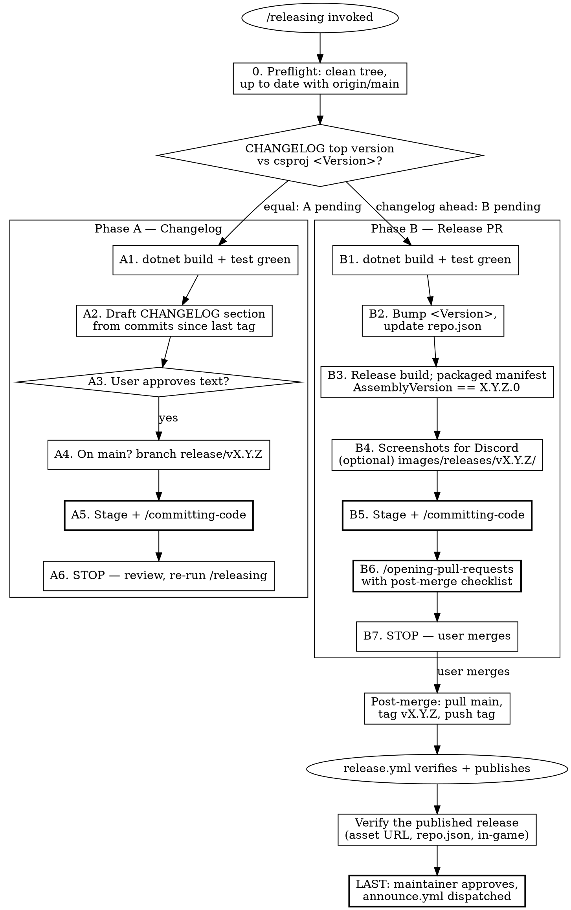

# Releasing

## Overview

Cuts a release in two phases with a manual review gate between them, then hands the actual
publishing to CI. Both phases are invoked via `/releasing`; the skill detects which phase is
pending from repo state. **The release artifact is never built or published from a developer
machine** — a pushed `vX.Y.Z` tag triggers `.github/workflows/release.yml`, which builds from
the tagged commit, verifies every version surface agrees, and publishes the GitHub Release
that `repo.json` points at. Publishing is where automation stops: the Discord **#releases**
announcement is a **separate, manually-dispatched workflow** (`announce.yml`), run as the
release's **very last step and only with the maintainer's explicit approval**, after every
post-merge verification has passed — the Release notes become the embed, and any images
committed under `images/releases/vX.Y.Z/` are attached as screenshots. The announcement can
never precede a verified release, and Claude never dispatches it on its own.

**Phase A — Changelog**: draft the player-facing `CHANGELOG.md` section for the new version,
commit it on a release branch via `/committing-code`. Stop for review.

**Phase B — Release PR**: bump the csproj `<Version>`, update `repo.json` to the new version's
asset URL, verify the packaged manifest locally, open the release PR via
`/opening-pull-requests`. Stop at PR creation — the user reviews and merges.

**Post-merge**: tag the squash commit on `main` and push the tag; CI publishes. Then verify
the published release end to end, and — last of all, on the maintainer's explicit go-ahead —
dispatch the Announce workflow.

**This skill overrides the "never stage, commit, or push without permission" directives** when
the user invokes `/releasing`: they are authorizing the staging, branch creation, commits,
branch push, PR, and (post-merge) tag push described here. Every message-approval gate inside
`/committing-code` and `/opening-pull-requests` still applies — override of the blanket rule,
never of the per-artifact approvals.

## The version surfaces (all derived from one string)

| Surface | Value for release 0.2.0 | Written by |
| --- | --- | --- |
| csproj `<Version>` | `0.2.0` | Phase B |
| Packaged manifest `AssemblyVersion` | `0.2.0.0` (SDK normalizes to 4 parts) | the build, from `<Version>` |
| `repo.json` `AssemblyVersion` | `0.2.0.0` (must equal the manifest exactly) | Phase B |
| `repo.json` `DownloadLink*` | `…/releases/download/v0.2.0/XIVShinies.SyncPlugin.zip` | Phase B |
| `CHANGELOG.md` top heading | `## v0.2.0 — YYYY-MM-DD` | Phase A |
| Git tag | `v0.2.0`, on the squash commit on `main` | post-merge, by hand |

Dalamud compares `repo.json`'s `AssemblyVersion` against the installed plugin's manifest to
offer updates — a mismatch means a broken update loop. `release.yml` refuses to publish unless
tag, csproj, repo.json, packaged manifest, and CHANGELOG all agree, so a missed surface fails
loudly in CI rather than silently in users' installers.

## Usage

```
/releasing patch|minor|major   # bump type for the new version
/releasing                     # recommend a bump type from the commits, then confirm
```

## Process



### Step 0 — Preflight (always)

1. **Clean tree.** `git status --porcelain` must be empty. If not, invoke `/committing-code`
   to land the in-progress work first — release commits stay tiny and single-purpose.
2. **Up to date.** `git fetch origin`; `git rev-list --count HEAD..origin/main` must be 0.
   If behind, show the missing commits and rebase before continuing — especially if any touch
   this skill or the workflows (a stale branch means running a stale release process).
3. **Phase detect.** Compare `CHANGELOG.md`'s top `## vX.Y.Z` heading (absent = treat as the
   csproj version, i.e. Phase A pending) against the csproj `<Version>`:
   - equal → **Phase A** (no entry for the next version yet)
   - changelog ahead → **Phase B**
   - changelog behind → confused state; stop and ask.

### Phase A — Changelog

1. Run `dotnet build` and `dotnet test` — both must be clean (0 warnings, 0 failures).
2. Determine the new version: current `<Version>` + the bump type (recommend one from
   `git log $(git describe --tags --abbrev=0)..HEAD --oneline` when not given; before any
   first tag exists, review the full history). Draft the section:

   ```markdown
   ## v0.2.0 — 2026-07-18

   - Player-facing change, present tense, one line
   - Another change
   ```

   Write for players installing the plugin, not for developers: no internal refactors, no
   file names, no PR numbers. This section becomes the GitHub Release notes verbatim — and
   the Discord announcement's embed text. Two hard style rules, matching the web app's
   changelog so the two products read as one voice in the shared #releases channel:
   - **Every bullet starts with a verb** (Stop, Support, Link, Show, Count, Fix, …) —
     "Count outfit gear toward relic proofs", never "Outfit gear now counts…".
   - **Keep each bullet to at most 75 characters**: at the embed's rendered width that is
     one line, and a bullet that wraps mid-sentence reads worse in Discord than a shorter
     one that says less.
3. Present the section as plain text for approval. Wait.
4. If on `main`, `git switch -c release/vX.Y.Z`; on any other branch, stay put and say so.
5. Insert the section directly under the CHANGELOG's intro (newest first), stage the file,
   and invoke `/committing-code` (suggested: `docs: add the vX.Y.Z changelog entry`).
6. **Stop.** Tell the user to review the entry and re-run `/releasing` for Phase B. Do NOT
   open a PR for Phase A alone: Phase B's commit lands on this same release branch, and one
   release PR carries both commits. The gate between phases is the user reviewing the commit
   and re-invoking the skill, not a merge.

### Phase B — Release PR

1. Same gates as A1.
2. Make the two version edits, matching the CHANGELOG's top version `X.Y.Z`:
   - csproj: `<Version>X.Y.Z</Version>`
   - `repo.json` (create from the template below on the first release): set `AssemblyVersion`
     to `X.Y.Z.0` and all three `DownloadLink*` to
     `https://github.com/noranda/xiv-shinies-plugin/releases/download/vX.Y.Z/XIVShinies.SyncPlugin.zip`.
     Keep the descriptive fields (Author, Name, Punchline, Description, Tags…) identical to
     the built manifest at `src/XIVShinies.SyncPlugin/bin/Release/XIVShinies.SyncPlugin/XIVShinies.SyncPlugin.json`
     — the manifest is the source; repo.json mirrors it.
3. `dotnet build --configuration Release -warnaserror`, then verify before anything ships:
   the packaged manifest's `AssemblyVersion` equals `X.Y.Z.0`, and
   `bin/Release/XIVShinies.SyncPlugin/latest.zip` exists. Run `dotnet test` too.
4. **Screenshots for the Discord announcement (optional).** If this release should be
   announced with images, ask the user for them and commit them as
   `images/releases/vX.Y.Z/*.png` in this same PR — the Announce workflow reads them from
   `main`'s checkout, so committing them in the release PR guarantees they are merged before
   the announcement is ever dispatched. They
   post in filename order (numeric-aware, so `1-`, `2-`, … `10-` orders naturally); at
   most **10** are attached — extras are dropped with only a CI-log warning, so keep the
   folder to ten or fewer. No folder means a text-only announcement, which is fine.
5. Stage the csproj + repo.json (+ README, first release only: remove the pre-release
   caveats — the status blockquote near the top and the "(once released)" qualifier on the
   install heading) and invoke `/committing-code` (suggested: `chore(release): vX.Y.Z`).
6. Invoke `/opening-pull-requests`. Title `chore(release): vX.Y.Z`; body must carry the
   changelog bullets (they double as reviewer-facing release notes) and this post-merge
   checklist:

   ```markdown
   ## Post-merge checklist

   - [ ] `git switch main && git pull --ff-only`
   - [ ] `git tag vX.Y.Z && git push origin vX.Y.Z`
   - [ ] Watch the Release workflow publish the GitHub Release with XIVShinies.SyncPlugin.zip
   - [ ] Verify raw repo.json serves the new AssemblyVersion and the asset URL returns 200
   - [ ] In-game: the custom-repo install/update works via /xlplugins
   - [ ] LAST, on the maintainer's explicit go-ahead: dispatch Announce
         (`gh workflow run announce.yml -f tag=vX.Y.Z`) and watch it post in #releases
   ```
7. **Stop.** The user reviews CI and merges.

### Post-merge — tag and hand off to CI

Only after the squash merge lands on `main`:

```powershell
git switch main
git pull --ff-only origin main
git tag vX.Y.Z          # on the squash commit — the code the release PR reviewed
git push origin vX.Y.Z
```

`release.yml` now builds from the tagged commit, re-verifies every version surface, and
publishes the release. The `protect-release-tags` ruleset makes pushed `v*` tags immutable —
a mistagged release is fixed by an admin deliberately deleting the tag (bypass), never by
moving it.

### The announcement — very last, and only on explicit approval

The Discord announcement **never fires automatically**. It is the final step of the whole
release, after every other post-merge box is verified:

1. Confirm the earlier checklist items are genuinely done: the Release workflow succeeded,
   raw `repo.json` serves the new `AssemblyVersion`, the asset URL returns 200, and the
   in-game update worked.
2. **Ask the maintainer for explicit approval to announce.** Verification passing is not
   approval; a literal "yes, announce it" (or the maintainer dispatching the workflow
   themselves) is. If anything upstream looked wrong, or a coordinated release (for example
   the web app's) has not landed yet, hold here — an unannounced good release costs nothing,
   a premature announcement cannot be unposted.
3. Only then dispatch: `gh workflow run announce.yml -f tag=vX.Y.Z`, and watch the run post
   in #releases.

`announce.yml` refuses a missing or draft release, and re-running it double-posts — re-run
only when the failed run demonstrably posted nothing.

**Check off the release PR's checkboxes as the post-merge steps complete.** The PR body's
test-plan and post-merge checklists are the release's record; a merged release PR with
unchecked boxes reads as unverified forever. Tick each box only once its item is actually
confirmed (the workflow published, the asset URL answers, the in-game update worked), then
write the body back:

```powershell
& "C:\Program Files\GitHub CLI\gh.exe" pr view <N> --json body -q .body   # flip - [ ] to - [x] for verified items
& "C:\Program Files\GitHub CLI\gh.exe" pr edit <N> --body-file <edited-body.md>
```

Never tick a box for a step that was skipped or is still pending — an honest unchecked box
beats a false record.

## Red Flags — STOP

| Excuse | Reality |
| ------ | ------- |
| "I'll build the zip locally and `gh release create`" | CI builds from the tagged commit. A local zip is unreproducible, and `gh release create` collides with the release the workflow publishes for the same tag. Push the tag; touch nothing else. |
| "Release notes can live in the PR body, skip CHANGELOG.md" | `release.yml` publishes the CHANGELOG's top section and **fails the release** if the tag's section is missing. The changelog is the notes. |
| "Changelog and bump in one PR saves a round trip" | Two phases with a review gate between them. Content gets reviewed before mechanics. |
| "Tag the release branch before merging" | Squash merge discards branch commits — the tag would point at a commit unreachable from `main`. Tag `main` after the merge, always. |
| "Bump the csproj, repo.json can catch up later" | Every surface ships together in the release PR or CI refuses the tag. There is no later. |
| "AssemblyVersion is 0.2.0 — three parts is fine" | The SDK normalizes to four parts (`0.2.0.0`); repo.json must match the packaged manifest exactly or update detection breaks. |
| "We're behind schedule, skip the approval gates" | Publishing to every installed client is the worst moment to skip review. The gates are the process. |
| "Push the tag now, the PR will merge in a minute" | The tag must point at the merged squash commit, which does not exist until the merge. Wait. |
| "CI is slow, I'll `gh pr merge` myself to speed it up" | The user merges release PRs. Stop at PR creation. |
| "The release verified clean, I'll dispatch the announcement" | Verification is not approval. The maintainer says "announce it" — or dispatches it themselves — every time. |
| "The Announce run failed, re-run it" | A re-run double-posts if the first run reached Discord. Re-run only when the log proves nothing posted. |

## repo.json template (first release)

```json
[
  {
    "Author": "Noranda",
    "Name": "XIV Shinies Sync",
    "InternalName": "XIVShinies.SyncPlugin",
    "AssemblyVersion": "X.Y.Z.0",
    "Description": "(copy from the built manifest)",
    "Punchline": "(copy from the built manifest)",
    "ApplicableVersion": "any",
    "RepoUrl": "https://github.com/noranda/xiv-shinies-plugin",
    "DalamudApiLevel": 15,
    "Tags": ["collection", "sync", "quests", "achievements", "mounts", "minions", "relics"],
    "CategoryTags": ["utility"],
    "IconUrl": "https://raw.githubusercontent.com/noranda/xiv-shinies-plugin/main/src/XIVShinies.SyncPlugin/images/icon.png",
    "ImageUrls": [],
    "DownloadLinkInstall": "https://github.com/noranda/xiv-shinies-plugin/releases/download/vX.Y.Z/XIVShinies.SyncPlugin.zip",
    "DownloadLinkUpdate": "https://github.com/noranda/xiv-shinies-plugin/releases/download/vX.Y.Z/XIVShinies.SyncPlugin.zip",
    "DownloadLinkTesting": "https://github.com/noranda/xiv-shinies-plugin/releases/download/vX.Y.Z/XIVShinies.SyncPlugin.zip"
  }
]
```

`DalamudApiLevel` must track the SDK major version in the csproj whenever it bumps.
`ImageUrls` may list up to five raw URLs to `images/gallery/*.png` — the resized installer
copies, capped at 730×380 because Dalamud rejects anything larger outright (see
`images/gallery/README.md`). They are served from `main`, so the gallery can be corrected
without cutting a release. Do not add `LastUpdate`/`DownloadCount` — server-computed fields
other repos carry are noise in a hand-maintained pluginmaster.
