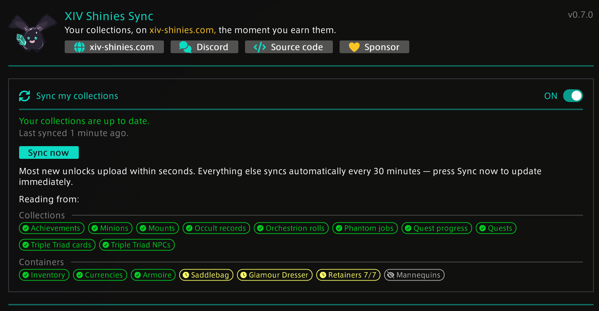
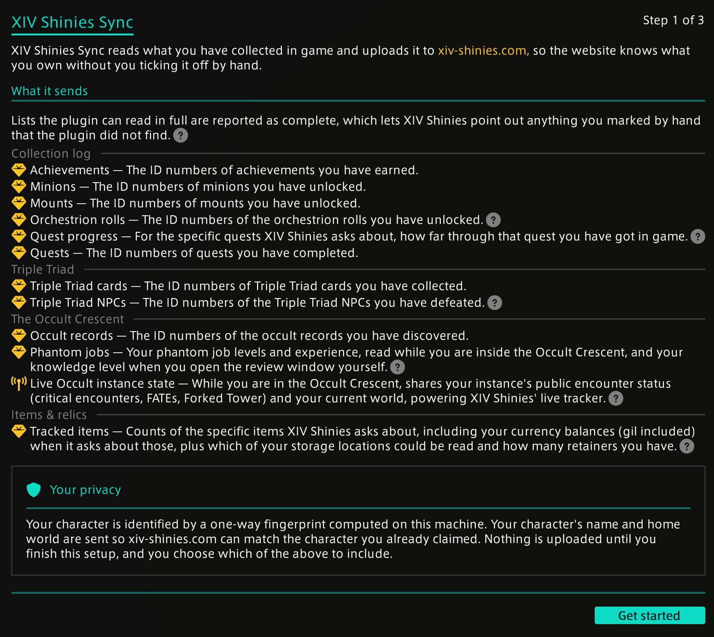
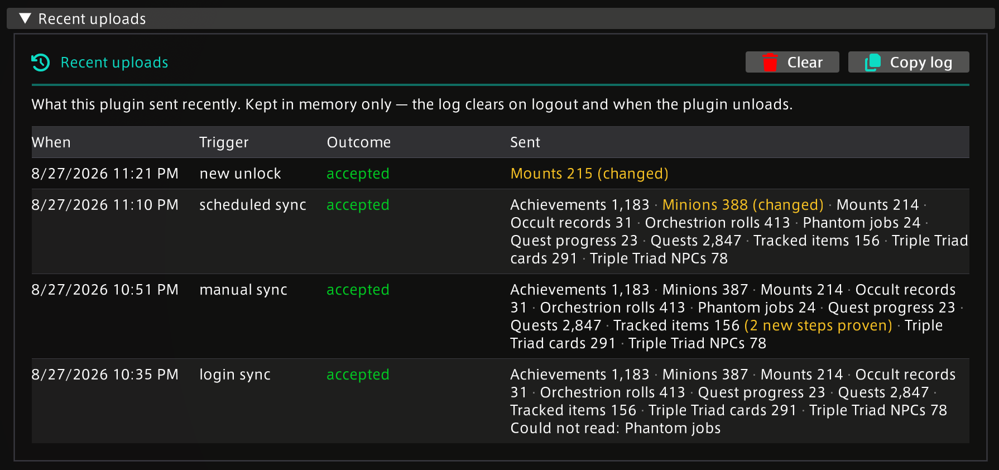

<div align="center">
  
  <h1>XIV Shinies Sync</h1>
  <p><em>Your collections, on <a href="https://xiv-shinies.com">xiv-shinies.com</a>, the moment you earn them.</em></p>
  <p>
    <a href="https://xiv-shinies.com">🌐 xiv-shinies.com</a>
    &nbsp;·&nbsp;
    <a href="https://discord.gg/UuNe5BwAGG">💬 Discord</a>
    &nbsp;·&nbsp;
    <a href="https://www.patreon.com/c/noranda/">💛 Sponsor</a>
  </p>
</div>

A [Dalamud](https://github.com/goatcorp/Dalamud) plugin for Final Fantasy XIV that
automatically records your collection progress on [XIV Shinies](https://xiv-shinies.com).
New unlocks — quests, achievements, mounts, minions, and more — appear on the site within
seconds, and everything else syncs automatically in the background, so you stop hand-marking
what you already earned.



## How it works

The plugin reads completion facts directly from your own game client and uploads them over
HTTPS to XIV Shinies, which does all the derivation server-side. A plugin upload is
first-party evidence from inside the game client, so it outranks a Lodestone scrape. It does
not prove ownership: uploads are accepted only for a character you have verified on the site
with the Lodestone bio code. The plugin itself is deliberately a **dumb fact-reader**: it
sends only raw facts the game knows and never computes site concepts like relic steps — which
keeps it stable as the site grows new collections and rules.

**Quests**, **Achievements**, **Mounts**, **Minions** and **Orchestrion rolls** upload within
seconds of the unlock, because the game announces those the moment they happen.

Everything else travels with the periodic full sync, or immediately when you press
**Sync now**: **Tracked items** (the item counts that prove relic progress), **Quest
progress**, **Triple Triad cards**, **Triple Triad NPCs**, **Occult records**, **Phantom jobs**,
**Gear & glamour storage** and **Character appearance**.

## What gets sent

Only your **own local character's** collection facts, and only for the categories you opt
into:

- Completed **quest** IDs
- Unlocked **achievement**, **mount**, and **minion** IDs
- Unlocked **orchestrion roll** IDs — the tunes playable from your orchestrion list, not the
  unused roll items sitting in your bags
- Collected **Triple Triad card** IDs, and the IDs of the game's own **Triple Triad NPCs** you
  have defeated — computer opponents, never other players
- **Possession counts** for the specific relic-stage items the server asks about — checked
  across your inventory, armoire, glamour dresser, saddlebag, and retainers
- **Phantom job levels and experience**, read while you are inside the Occult Crescent, and
  your **knowledge level** when you open the review window yourself
- Discovered **occult record** IDs
- Bestiary numbers of the **beasts you have tamed** as a beastmaster, read from your Master's
  Bestiary when you open it. The bestiary shows part of itself at a time and remembers the last
  filter you set, so page through it once with no filter applied and the whole set is read.
  Nothing is read while the window is closed, and other players are never involved
- The ID numbers and copy counts of the **gear you hold and where it is kept**: your Glamour
  Dresser (with each piece's quality and dyes), outfit glamours, Armoire, and the gear you wear or
  keep in your bags, armoury chest, saddlebag, retainers and retainer market listings, down to
  which retainer holds each piece — plus which of those storage locations could be read, how many
  retainers you have, and their names. A retainer is identified by a one-way hash of its id, never
  the id itself, and its name is read only once you have used a summoning bell this session. Gear
  only; materials and other items are never included. Your bags, equipped gear and armoury chest
  are read at login and on every scheduled or manual sync; the dresser, Armoire and saddlebag once
  you have opened and closed each one this session (dresser dyes only in the area where you opened
  it); and your retainers from the game's saved copy of each one you have summoned, which survives
  logging out, plus the market listings of the one summoned most recently. Nothing is read while a
  storage window is open. This is a picture of what you hold right now, so the site can tell when
  a piece has left your storage — though nothing you marked by hand is ever unmarked
- Your **character's appearance** as set in the character creator (race, clan, gender, face, hair,
  eyes, colors and body), the glasses you wear, and your display settings: whether your weapon,
  headgear, visor, Viera ears and Free Company crest are shown — read from your own character, so
  XIV Shinies can draw you as you are
- **Live Occult Crescent instance state**, while you are inside one: which critical
  encounters, FATEs, and Forked Tower windows are up in your instance, and which world you
  are on, powering the site's live occult tracker on the right data center. This is world
  state — nothing about you beyond your presence in the instance, and never anything about
  other players. It starts enabled (the setup wizard shows the ticked box before anything
  sends) and can be switched off any time in the settings. If XIV Shinies has the tracker
  switched off while you are setting up, the wizard cannot offer you that box — so it starts
  **off** instead, and you can turn it on from the settings whenever you like

The gear and appearance collections are read only once the XIV Shinies server names them; until
it does, the settings show them as not offered, and neither is read.

For a collection the plugin can read end to end, the upload also declares that the list is
complete. That is what lets the site point out something you marked by hand that the plugin
did not find, so you can review it — nothing is ever unmarked for you.

Your character is identified by a **one-way fingerprint computed on your machine** — the raw
ContentId never leaves the game process, and never lands in logs or config. Your character's
name and home world are sent so the site can match the character you already claimed and
verified there (with the Lodestone bio code). Nothing about other players is ever read or sent.

The exact wire format is documented in [`docs/api-contract.md`](docs/api-contract.md); the
deployed XIV Shinies server is its authority. How each Dalamud rule is satisfied is documented
rule-by-rule in [`docs/dalamud-compliance.md`](docs/dalamud-compliance.md).

## Fully opt-in

Nothing uploads until you finish a short first-run setup that shows exactly what each
collection sends and asks you to switch categories on explicitly. Every category — and syncing
as a whole — can be toggled at any time from the settings window (`/shinies`).

Setup also offers to start collections added by later updates already switched on, so that if you
always opt in you are not asked every time. It is off unless you tick it, and either way a new
collection is marked **New** in the settings until you have seen it.



## See exactly what was sent

The settings window keeps a **Recent uploads** log: every collection upload's time, trigger,
outcome, and per-category counts, with changes since the previous upload highlighted. The live
Occult tracker uploads too often to list, so it appears only when an upload is refused and
sharing stops until you fix it. **Copy log** puts a plain-text version on your clipboard for
bug reports — it carries counts, outcomes, and failure diagnostics only, never IDs or character
identity. The log lives in memory and clears on logout and when the plugin unloads.



## Installing

### From the plugin repository

1. In-game, open `/xlsettings` → **Experimental**.
2. Add this URL under **Custom Plugin Repositories**:

   ```
   https://raw.githubusercontent.com/XIV-Shinies/xiv-shinies-plugin/main/repo.json
   ```

3. Save, then install **XIV Shinies Sync** from `/xlplugins`.

### For development

See [CONTRIBUTING.md](CONTRIBUTING.md) for prerequisites, building, loading the dev plugin
in-game, and the project's testing philosophy.

## Contributing, security, and AI disclosure

- **Contributions** are welcome — read [CONTRIBUTING.md](CONTRIBUTING.md) first; this project
  follows [Dalamud's plugin guidelines](https://dalamud.dev/plugin-publishing/restrictions/)
  strictly, and PRs are reviewed against them.
- **Security issues**: see [SECURITY.md](SECURITY.md) — please report privately.
- **AI involvement** in this codebase is disclosed centrally in
  [AI-DECLARATION.md](AI-DECLARATION.md). The plugin icon and all shipped imagery are
  hand-made.

## License

[MIT](LICENSE) © Noranda
